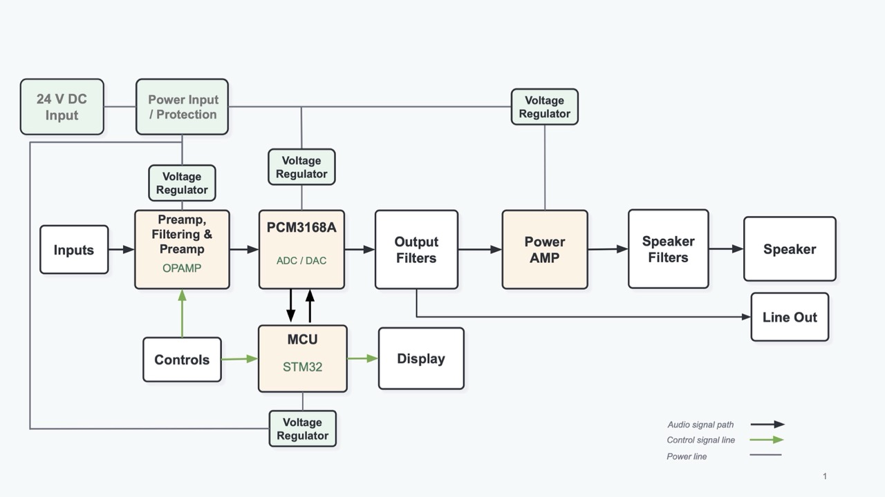

# System Architecture

The Compact Real-Time Audio Processor combines analog audio circuitry, digital audio conversion, STM32-based real-time processing, physical controls, a graphical display, power electronics, and audio output hardware.

This document describes the high-level system architecture. Detailed electrical interfaces, pin assignments, clocking, and circuit values will be documented as the individual subsystems are designed.

---

## System Block Diagram

The current draft system architecture is shown below.

The diagram is a working design and will be updated as subsystem decisions are finalized.

---

## Signal Flow

At a high level, audio follows this path:

**Audio Inputs → Analog Front End → Audio Codec → STM32 Processing → Audio Codec → Output Stage**

---

### Inputs

The baseline system supports:

- Balanced XLR dynamic microphone input
- 1/4-inch high-impedance instrument input
- 1/8-inch stereo consumer line-level input

Each source uses an appropriate analog front end for gain, filtering, protection, and signal conditioning before reaching the audio codec.

---

### Audio Codec

The current codec selection is the **Texas Instruments PCM3168A**.

The codec provides analog-to-digital and digital-to-analog conversion between the analog audio circuitry and STM32 processor.

The exact digital audio format, channel allocation, and clock configuration will be finalized during codec and MCU integration.

---

### MCU and DSP

The current microcontroller selection is the **STM32H750IBT6**.

The MCU is responsible for:

- Digital audio transport
- Software-controlled input mixing
- Real-time DSP
- User-interface control
- Display communication
- External memory access
- Overall system coordination

The baseline audio sample rate is **48 kHz**.

The baseline global DSP chain includes:

- Three-band EQ
- Overdrive / distortion
- Digital delay

The final ordering and parameter ranges of these effects will be determined during DSP development.

---

### User Interface

Physical controls provide user input to the STM32.

The STM32 drives the graphical display and provides feedback about system state, parameters, and effects.

The exact control mapping and interface behavior are still under development.

---

### External Memory

External memory connects to the STM32 and will support system data that must persist outside the MCU's internal memory.

The exact use of external memory will be defined as the firmware architecture develops.

---

### Audio Output

Processed digital audio is converted back to analog through the PCM3168A and passed through the required output conditioning circuitry.

The current baseline project includes a Class-D amplifier and full-range speaker.

> **TEAM REVIEW REQUIRED:** Finalize whether stereo 1/4-inch line outputs will also be included, and determine how they branch from the codec/output stage.

---

### Power

The power subsystem provides the voltage rails required by the analog, digital, display, codec, and amplifier subsystems.

The current design work includes a 24 V external supply and local voltage regulation, but the final power architecture, regulator arrangement, and power-distribution strategy are still being developed.

---

## Subsystems

| Subsystem           | Primary Responsibility                                       |
| ------------------- | ------------------------------------------------------------ |
| Analog Front End    | Input gain, filtering, protection, and signal conditioning   |
| Audio Codec         | Analog/digital conversion and multichannel audio interface   |
| MCU / Firmware      | Audio transport, mixing, DSP, controls, display, and system coordination |
| User Interface      | Physical controls and graphical feedback                     |
| Memory              | External storage for persistent system data                  |
| Output Stage        | Analog output conditioning and routing                       |
| Amplifier / Speaker | Powered audio reproduction                                   |
| Power               | Supply regulation, distribution, filtering, and protection   |
| PCB / Mechanical    | Physical integration of the electronic and mechanical subsystems |

---

## Open Architecture Decisions

The following system-level decisions still need to be finalized:

- Final line-output architecture
- Codec channel allocation
- Digital audio format and clocking between the codec and MCU
- DSP processing order
- External-memory usage
- Final power architecture and voltage rails
- Final control and display architecture

Significant decisions that affect multiple subsystems should be documented in [`docs/decisions/`](decisions/).

#### Key Interfaces Under Development

Several subsystem interfaces still need to be defined as prototype workprogresses.

| Interface           | Between                                    | Current Status                                               |
| ------------------- | ------------------------------------------ | ------------------------------------------------------------ |
| Analog Inputs       | Input front ends → PCM3168A                | Gain, impedance, signal levels, filtering, and protection still need to be finalized |
| Digital Audio       | PCM3168A ↔ STM32H750IBT6                   | Audio format, channel mapping, clocking, and MCU peripheral configuration still need to be verified |
| Codec Control       | STM32H750IBT6 ↔ PCM3168A                   | Configuration interface and initialization sequence still need to be defined |
| Audio Output        | PCM3168A → output stage                    | Output conditioning and final line-output routing remain under review |
| Amplifier / Speaker | Output stage → Class-D amplifier → speaker | Amplifier interface, load, filtering, and thermal requirements still need to be finalized |
| User Interface      | Controls / display ↔ STM32                 | Control mapping, display interface, and update behavior are still under development |
| External Memory     | STM32 ↔ external memory                    | Memory interface and firmware usage still need to be finalized |
| Power               | Power subsystem → electronics              | Required rails, current budgets, regulation, filtering, and sequencing are still being developed |

Detailed pin assignments, electrical specifications, timing, buffer organization, and other implementation details should be documented with the relevant subsystem once those designs exist.
